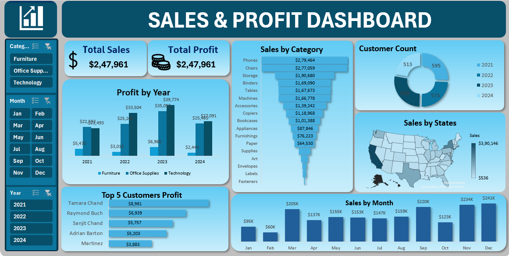

# 📊 Sales & Profit Data Analytics Project

## 📝 Overview
This project focuses on analyzing sales and profit data using **Excel**.  
It includes steps such as data loading, cleaning, pivot table creation, and designing a fully interactive dashboard.

## 📂 Dataset
- **File:** Sales and Profit Dashboard Data.xlsx  
- The dataset contains order details such as date, region, category, sales, and profit.
- Cleaned and prepared before analysis.

## 🛠 Tools Used
- **Microsoft Excel**
- Pivot Tables
- Power Query (optional)
- Charts & Dashboard Tools

## 🔍 Steps Performed
1. Loaded the Excel dataset.  
2. Cleaned missing values, removed duplicates, and formatted columns.  
3. Created pivot tables for:
   - Region-wise Sales & Profit  
   - Category performance  
   - Monthly trends  
4. Designed an interactive dashboard with slicers and KPIs.  

## 📸 Dashboard Preview

## 📈 Results
- Clear insights into top-performing regions and product categories.
- Identified profit trends and sales fluctuations.
- Easy-to-use dashboard for decision-making.

## ▶️ How to Run
1. Download this repository.  
2. Open the Excel file **Sales and Profit Dashboard Data.xlsx**.  
3. Go to the **Dashboard** sheet.  
4. Use slicers and charts to interact with the data.

## 📬 Contact
**Author:** Alka K S  
**Role:** Data Analyst Intern  
**Email:** [alkaks3995@gmail.com](mailto:alkaks3995@gmail.com)  
**LinkedIn:** [www.linkedin.com/in/alka-k-s](https://www.linkedin.com/in/alka-k-s)

